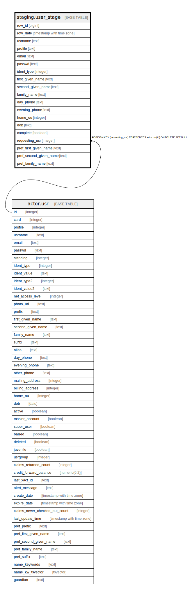

# staging.user_stage

## Description

## Columns

| Name | Type | Default | Nullable | Children | Parents | Comment |
| ---- | ---- | ------- | -------- | -------- | ------- | ------- |
| row_id | bigint | nextval('staging.user_stage_row_id_seq'::regclass) | false |  |  |  |
| row_date | timestamp with time zone | now() | true |  |  |  |
| usrname | text |  | false |  |  |  |
| profile | text |  | true |  |  |  |
| email | text |  | true |  |  |  |
| passwd | text |  | true |  |  |  |
| ident_type | integer | 3 | true |  |  |  |
| first_given_name | text |  | true |  |  |  |
| second_given_name | text |  | true |  |  |  |
| family_name | text |  | true |  |  |  |
| day_phone | text |  | true |  |  |  |
| evening_phone | text |  | true |  |  |  |
| home_ou | integer | 2 | true |  |  |  |
| dob | text |  | true |  |  |  |
| complete | boolean | false | true |  |  |  |
| requesting_usr | integer |  | true |  | [actor.usr](actor.usr.md) |  |
| pref_first_given_name | text |  | true |  |  |  |
| pref_second_given_name | text |  | true |  |  |  |
| pref_family_name | text |  | true |  |  |  |

## Constraints

| Name | Type | Definition |
| ---- | ---- | ---------- |
| user_stage_requesting_usr_fkey | FOREIGN KEY | FOREIGN KEY (requesting_usr) REFERENCES actor.usr(id) ON DELETE SET NULL |
| user_stage_pkey | PRIMARY KEY | PRIMARY KEY (row_id) |

## Indexes

| Name | Definition |
| ---- | ---------- |
| user_stage_pkey | CREATE UNIQUE INDEX user_stage_pkey ON staging.user_stage USING btree (row_id) |

## Relations

---

> Generated by [tbls](https://github.com/k1LoW/tbls)
