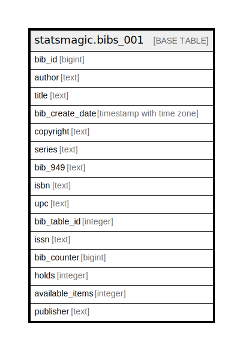

# statsmagic.bibs_001

## Description

## Columns

| Name | Type | Default | Nullable | Children | Parents | Comment |
| ---- | ---- | ------- | -------- | -------- | ------- | ------- |
| bib_id | bigint |  | false |  |  |  |
| author | text |  | true |  |  |  |
| title | text |  | true |  |  |  |
| bib_create_date | timestamp with time zone |  | true |  |  |  |
| copyright | text |  | true |  |  |  |
| series | text |  | true |  |  |  |
| bib_949 | text |  | true |  |  |  |
| isbn | text |  | true |  |  |  |
| upc | text |  | true |  |  |  |
| bib_table_id | integer | nextval('statsmagic.bibs_001_bib_table_id_seq'::regclass) | false |  |  |  |
| issn | text |  | true |  |  |  |
| bib_counter | bigint |  | true |  |  |  |
| holds | integer |  | true |  |  |  |
| available_items | integer |  | true |  |  |  |
| publisher | text |  | true |  |  |  |

## Constraints

| Name | Type | Definition |
| ---- | ---- | ---------- |
| bibs_001_pkey | PRIMARY KEY | PRIMARY KEY (bib_id) |

## Indexes

| Name | Definition |
| ---- | ---------- |
| bibs_001_pkey | CREATE UNIQUE INDEX bibs_001_pkey ON statsmagic.bibs_001 USING btree (bib_id) |
| bib_counter_index | CREATE INDEX bib_counter_index ON statsmagic.bibs_001 USING btree (bib_counter) |
| bib_create_date_index | CREATE INDEX bib_create_date_index ON statsmagic.bibs_001 USING btree (bib_create_date) |
| bib_id_index | CREATE INDEX bib_id_index ON statsmagic.bibs_001 USING btree (bib_id) |
| copyright_index | CREATE INDEX copyright_index ON statsmagic.bibs_001 USING btree (copyright) |

## Relations

---

> Generated by [tbls](https://github.com/k1LoW/tbls)
