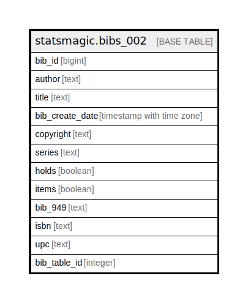

# statsmagic.bibs_002

## Description

## Columns

| Name | Type | Default | Nullable | Children | Parents | Comment |
| ---- | ---- | ------- | -------- | -------- | ------- | ------- |
| bib_id | bigint |  | true |  |  |  |
| author | text |  | true |  |  |  |
| title | text |  | true |  |  |  |
| bib_create_date | timestamp with time zone |  | true |  |  |  |
| copyright | text |  | true |  |  |  |
| series | text |  | true |  |  |  |
| holds | boolean |  | true |  |  |  |
| items | boolean |  | true |  |  |  |
| bib_949 | text |  | true |  |  |  |
| isbn | text |  | true |  |  |  |
| upc | text |  | true |  |  |  |
| bib_table_id | integer |  | true |  |  |  |

## Relations

---

> Generated by [tbls](https://github.com/k1LoW/tbls)
