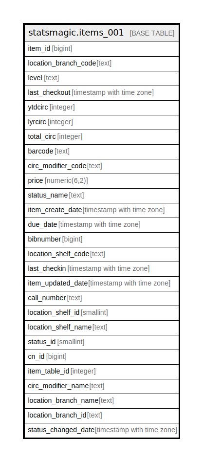

# statsmagic.items_001

## Description

## Columns

| Name | Type | Default | Nullable | Children | Parents | Comment |
| ---- | ---- | ------- | -------- | -------- | ------- | ------- |
| item_id | bigint |  | false |  |  |  |
| location_branch_code | text |  | true |  |  |  |
| level | text |  | true |  |  |  |
| last_checkout | timestamp with time zone |  | true |  |  |  |
| ytdcirc | integer |  | true |  |  |  |
| lyrcirc | integer |  | true |  |  |  |
| total_circ | integer |  | true |  |  |  |
| barcode | text |  | true |  |  |  |
| circ_modifier_code | text |  | true |  |  |  |
| price | numeric(6,2) |  | true |  |  |  |
| status_name | text |  | true |  |  |  |
| item_create_date | timestamp with time zone |  | true |  |  |  |
| due_date | timestamp with time zone |  | true |  |  |  |
| bibnumber | bigint |  | false |  |  |  |
| location_shelf_code | text |  | true |  |  |  |
| last_checkin | timestamp with time zone |  | true |  |  |  |
| item_updated_date | timestamp with time zone |  | true |  |  |  |
| call_number | text |  | true |  |  |  |
| location_shelf_id | smallint |  | true |  |  |  |
| location_shelf_name | text |  | true |  |  |  |
| status_id | smallint |  | true |  |  |  |
| cn_id | bigint |  | false |  |  |  |
| item_table_id | integer | nextval('statsmagic.items_001_item_table_id_seq'::regclass) | false |  |  |  |
| circ_modifier_name | text |  | true |  |  |  |
| location_branch_name | text |  | true |  |  |  |
| location_branch_id | text |  | true |  |  |  |
| status_changed_date | timestamp with time zone |  | true |  |  |  |

## Constraints

| Name | Type | Definition |
| ---- | ---- | ---------- |
| items_001_pkey | PRIMARY KEY | PRIMARY KEY (item_id) |

## Indexes

| Name | Definition |
| ---- | ---------- |
| items_001_pkey | CREATE UNIQUE INDEX items_001_pkey ON statsmagic.items_001 USING btree (item_id) |
| bibnumber_index | CREATE INDEX bibnumber_index ON statsmagic.items_001 USING btree (bibnumber) |
| call_number_index | CREATE INDEX call_number_index ON statsmagic.items_001 USING btree (call_number) |
| last_checkout_index | CREATE INDEX last_checkout_index ON statsmagic.items_001 USING btree (last_checkout) |
| location_code_index | CREATE INDEX location_code_index ON statsmagic.items_001 USING btree (location_shelf_code) |

## Relations

---

> Generated by [tbls](https://github.com/k1LoW/tbls)
