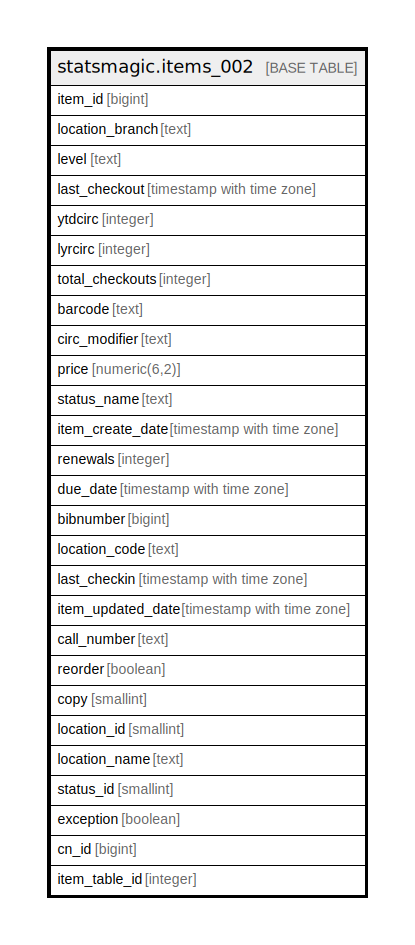

# statsmagic.items_002

## Description

## Columns

| Name | Type | Default | Nullable | Children | Parents | Comment |
| ---- | ---- | ------- | -------- | -------- | ------- | ------- |
| item_id | bigint |  | true |  |  |  |
| location_branch | text |  | true |  |  |  |
| level | text |  | true |  |  |  |
| last_checkout | timestamp with time zone |  | true |  |  |  |
| ytdcirc | integer |  | true |  |  |  |
| lyrcirc | integer |  | true |  |  |  |
| total_checkouts | integer |  | true |  |  |  |
| barcode | text |  | true |  |  |  |
| circ_modifier | text |  | true |  |  |  |
| price | numeric(6,2) |  | true |  |  |  |
| status_name | text |  | true |  |  |  |
| item_create_date | timestamp with time zone |  | true |  |  |  |
| renewals | integer |  | true |  |  |  |
| due_date | timestamp with time zone |  | true |  |  |  |
| bibnumber | bigint |  | true |  |  |  |
| location_code | text |  | true |  |  |  |
| last_checkin | timestamp with time zone |  | true |  |  |  |
| item_updated_date | timestamp with time zone |  | true |  |  |  |
| call_number | text |  | true |  |  |  |
| reorder | boolean |  | true |  |  |  |
| copy | smallint |  | true |  |  |  |
| location_id | smallint |  | true |  |  |  |
| location_name | text |  | true |  |  |  |
| status_id | smallint |  | true |  |  |  |
| exception | boolean |  | true |  |  |  |
| cn_id | bigint |  | true |  |  |  |
| item_table_id | integer |  | true |  |  |  |

## Relations

---

> Generated by [tbls](https://github.com/k1LoW/tbls)
