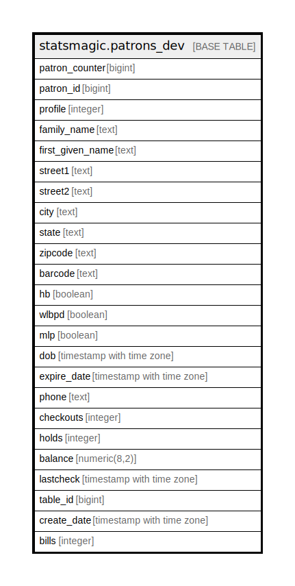

# statsmagic.patrons_dev

## Description

## Columns

| Name | Type | Default | Nullable | Children | Parents | Comment |
| ---- | ---- | ------- | -------- | -------- | ------- | ------- |
| patron_counter | bigint |  | true |  |  |  |
| patron_id | bigint |  | true |  |  |  |
| profile | integer |  | true |  |  |  |
| family_name | text |  | true |  |  |  |
| first_given_name | text |  | true |  |  |  |
| street1 | text |  | true |  |  |  |
| street2 | text |  | true |  |  |  |
| city | text |  | true |  |  |  |
| state | text |  | true |  |  |  |
| zipcode | text |  | true |  |  |  |
| barcode | text |  | true |  |  |  |
| hb | boolean |  | true |  |  |  |
| wlbpd | boolean |  | true |  |  |  |
| mlp | boolean |  | true |  |  |  |
| dob | timestamp with time zone |  | true |  |  |  |
| expire_date | timestamp with time zone |  | true |  |  |  |
| phone | text |  | true |  |  |  |
| checkouts | integer |  | true |  |  |  |
| holds | integer |  | true |  |  |  |
| balance | numeric(8,2) |  | true |  |  |  |
| lastcheck | timestamp with time zone |  | true |  |  |  |
| table_id | bigint |  | true |  |  |  |
| create_date | timestamp with time zone |  | true |  |  |  |
| bills | integer |  | true |  |  |  |

## Relations

---

> Generated by [tbls](https://github.com/k1LoW/tbls)
