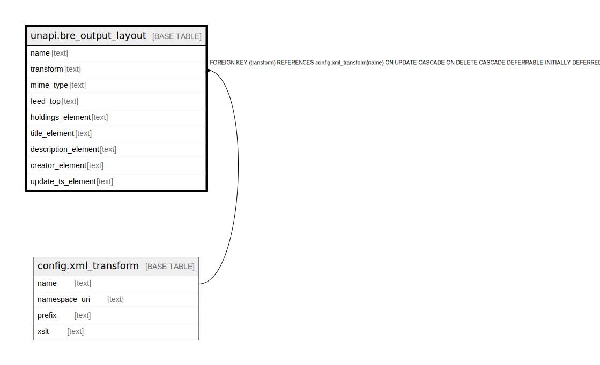

# unapi.bre_output_layout

## Description

## Columns

| Name | Type | Default | Nullable | Children | Parents | Comment |
| ---- | ---- | ------- | -------- | -------- | ------- | ------- |
| name | text |  | false |  |  |  |
| transform | text |  | true |  | [config.xml_transform](config.xml_transform.md) |  |
| mime_type | text |  | false |  |  |  |
| feed_top | text |  | false |  |  |  |
| holdings_element | text |  | true |  |  |  |
| title_element | text |  | true |  |  |  |
| description_element | text |  | true |  |  |  |
| creator_element | text |  | true |  |  |  |
| update_ts_element | text |  | true |  |  |  |

## Constraints

| Name | Type | Definition |
| ---- | ---- | ---------- |
| bre_output_layout_transform_fkey | FOREIGN KEY | FOREIGN KEY (transform) REFERENCES config.xml_transform(name) ON UPDATE CASCADE ON DELETE CASCADE DEFERRABLE INITIALLY DEFERRED |
| bre_output_layout_pkey | PRIMARY KEY | PRIMARY KEY (name) |

## Indexes

| Name | Definition |
| ---- | ---------- |
| bre_output_layout_pkey | CREATE UNIQUE INDEX bre_output_layout_pkey ON unapi.bre_output_layout USING btree (name) |

## Relations

---

> Generated by [tbls](https://github.com/k1LoW/tbls)
