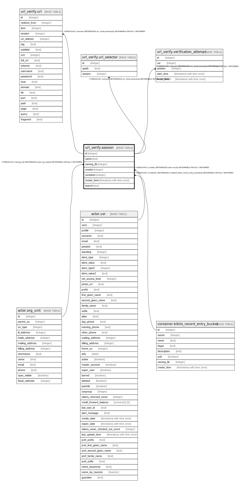

# url_verify.session

## Description

## Columns

| Name | Type | Default | Nullable | Children | Parents | Comment |
| ---- | ---- | ------- | -------- | -------- | ------- | ------- |
| id | integer | nextval('url_verify.session_id_seq'::regclass) | false | [url_verify.url](url_verify.url.md) [url_verify.url_selector](url_verify.url_selector.md) [url_verify.verification_attempt](url_verify.verification_attempt.md) |  |  |
| name | text |  | false |  |  |  |
| owning_lib | integer |  | false |  | [actor.org_unit](actor.org_unit.md) |  |
| creator | integer |  | false |  | [actor.usr](actor.usr.md) |  |
| container | integer |  | false |  | [container.biblio_record_entry_bucket](container.biblio_record_entry_bucket.md) |  |
| create_time | timestamp with time zone | now() | false |  |  |  |
| search | text |  | false |  |  |  |

## Constraints

| Name | Type | Definition |
| ---- | ---- | ---------- |
| session_owning_lib_fkey | FOREIGN KEY | FOREIGN KEY (owning_lib) REFERENCES actor.org_unit(id) DEFERRABLE INITIALLY DEFERRED |
| session_creator_fkey | FOREIGN KEY | FOREIGN KEY (creator) REFERENCES actor.usr(id) DEFERRABLE INITIALLY DEFERRED |
| session_container_fkey | FOREIGN KEY | FOREIGN KEY (container) REFERENCES container.biblio_record_entry_bucket(id) DEFERRABLE INITIALLY DEFERRED |
| session_pkey | PRIMARY KEY | PRIMARY KEY (id) |
| uvs_name_once_per_lib | UNIQUE | UNIQUE (name, owning_lib) |

## Indexes

| Name | Definition |
| ---- | ---------- |
| session_pkey | CREATE UNIQUE INDEX session_pkey ON url_verify.session USING btree (id) |
| uvs_name_once_per_lib | CREATE UNIQUE INDEX uvs_name_once_per_lib ON url_verify.session USING btree (name, owning_lib) |

## Relations

---

> Generated by [tbls](https://github.com/k1LoW/tbls)
