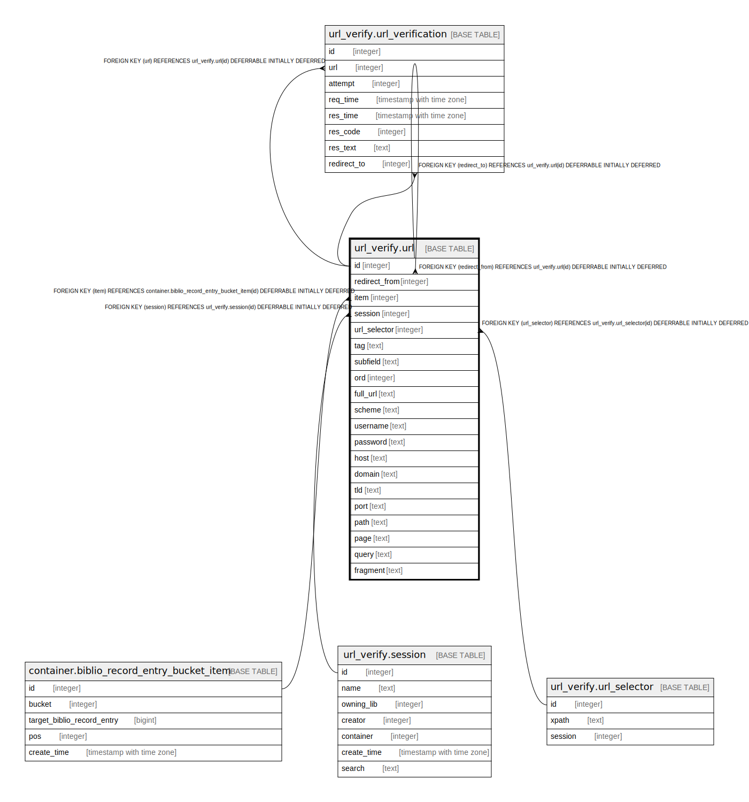

# url_verify.url

## Description

## Columns

| Name | Type | Default | Nullable | Children | Parents | Comment |
| ---- | ---- | ------- | -------- | -------- | ------- | ------- |
| id | integer | nextval('url_verify.url_id_seq'::regclass) | false | [url_verify.url](url_verify.url.md) [url_verify.url_verification](url_verify.url_verification.md) |  |  |
| redirect_from | integer |  | true |  | [url_verify.url](url_verify.url.md) |  |
| item | integer |  | true |  | [container.biblio_record_entry_bucket_item](container.biblio_record_entry_bucket_item.md) |  |
| session | integer |  | true |  | [url_verify.session](url_verify.session.md) |  |
| url_selector | integer |  | true |  | [url_verify.url_selector](url_verify.url_selector.md) |  |
| tag | text |  | true |  |  |  |
| subfield | text |  | true |  |  |  |
| ord | integer |  | true |  |  |  |
| full_url | text |  | false |  |  |  |
| scheme | text |  | true |  |  |  |
| username | text |  | true |  |  |  |
| password | text |  | true |  |  |  |
| host | text |  | true |  |  |  |
| domain | text |  | true |  |  |  |
| tld | text |  | true |  |  |  |
| port | text |  | true |  |  |  |
| path | text |  | true |  |  |  |
| page | text |  | true |  |  |  |
| query | text |  | true |  |  |  |
| fragment | text |  | true |  |  |  |

## Constraints

| Name | Type | Definition |
| ---- | ---- | ---------- |
| redirect_or_from_item | CHECK | CHECK (((redirect_from IS NOT NULL) OR ((item IS NOT NULL) AND (url_selector IS NOT NULL) AND (tag IS NOT NULL) AND (subfield IS NOT NULL) AND (ord IS NOT NULL)))) |
| url_item_fkey | FOREIGN KEY | FOREIGN KEY (item) REFERENCES container.biblio_record_entry_bucket_item(id) DEFERRABLE INITIALLY DEFERRED |
| url_session_fkey | FOREIGN KEY | FOREIGN KEY (session) REFERENCES url_verify.session(id) DEFERRABLE INITIALLY DEFERRED |
| url_pkey | PRIMARY KEY | PRIMARY KEY (id) |
| url_redirect_from_fkey | FOREIGN KEY | FOREIGN KEY (redirect_from) REFERENCES url_verify.url(id) DEFERRABLE INITIALLY DEFERRED |
| url_url_selector_fkey | FOREIGN KEY | FOREIGN KEY (url_selector) REFERENCES url_verify.url_selector(id) DEFERRABLE INITIALLY DEFERRED |

## Indexes

| Name | Definition |
| ---- | ---------- |
| url_pkey | CREATE UNIQUE INDEX url_pkey ON url_verify.url USING btree (id) |

## Triggers

| Name | Definition |
| ---- | ---------- |
| ingest_url_tgr | CREATE TRIGGER ingest_url_tgr BEFORE INSERT ON url_verify.url FOR EACH ROW EXECUTE PROCEDURE url_verify.ingest_url() |

## Relations

---

> Generated by [tbls](https://github.com/k1LoW/tbls)
