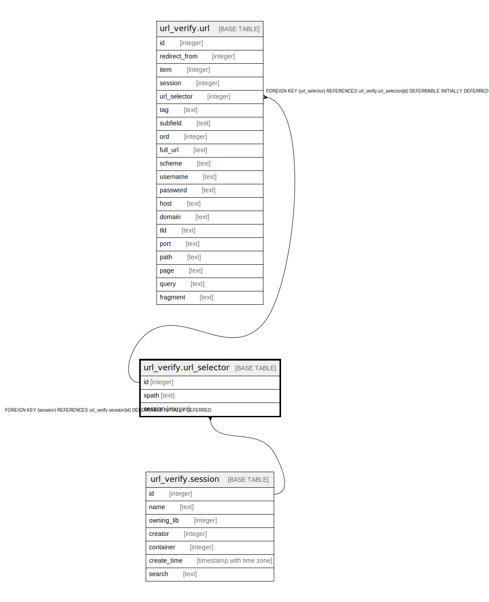

# url_verify.url_selector

## Description

## Columns

| Name | Type | Default | Nullable | Children | Parents | Comment |
| ---- | ---- | ------- | -------- | -------- | ------- | ------- |
| id | integer | nextval('url_verify.url_selector_id_seq'::regclass) | false | [url_verify.url](url_verify.url.md) |  |  |
| xpath | text |  | false |  |  |  |
| session | integer |  | false |  | [url_verify.session](url_verify.session.md) |  |

## Constraints

| Name | Type | Definition |
| ---- | ---- | ---------- |
| url_selector_session_fkey | FOREIGN KEY | FOREIGN KEY (session) REFERENCES url_verify.session(id) DEFERRABLE INITIALLY DEFERRED |
| tag_once_per_sess | UNIQUE | UNIQUE (xpath, session) |
| url_selector_pkey | PRIMARY KEY | PRIMARY KEY (id) |

## Indexes

| Name | Definition |
| ---- | ---------- |
| tag_once_per_sess | CREATE UNIQUE INDEX tag_once_per_sess ON url_verify.url_selector USING btree (xpath, session) |
| url_selector_pkey | CREATE UNIQUE INDEX url_selector_pkey ON url_verify.url_selector USING btree (id) |

## Relations

---

> Generated by [tbls](https://github.com/k1LoW/tbls)
