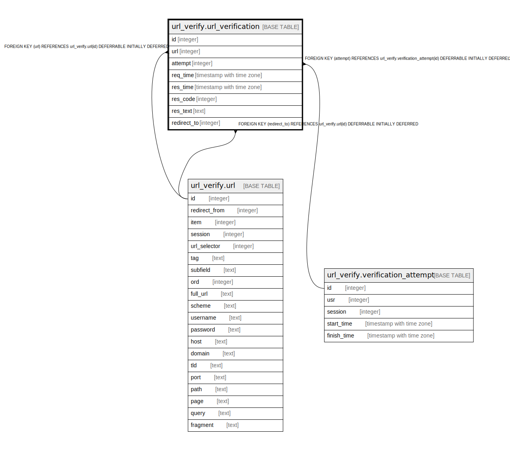

# url_verify.url_verification

## Description

## Columns

| Name | Type | Default | Nullable | Children | Parents | Comment |
| ---- | ---- | ------- | -------- | -------- | ------- | ------- |
| id | integer | nextval('url_verify.url_verification_id_seq'::regclass) | false |  |  |  |
| url | integer |  | false |  | [url_verify.url](url_verify.url.md) |  |
| attempt | integer |  | false |  | [url_verify.verification_attempt](url_verify.verification_attempt.md) |  |
| req_time | timestamp with time zone | now() | false |  |  |  |
| res_time | timestamp with time zone |  | true |  |  |  |
| res_code | integer |  | true |  |  |  |
| res_text | text |  | true |  |  |  |
| redirect_to | integer |  | true |  | [url_verify.url](url_verify.url.md) |  |

## Constraints

| Name | Type | Definition |
| ---- | ---- | ---------- |
| url_verification_res_code_check | CHECK | CHECK (((res_code >= 100) AND (res_code <= 999))) |
| url_verification_redirect_to_fkey | FOREIGN KEY | FOREIGN KEY (redirect_to) REFERENCES url_verify.url(id) DEFERRABLE INITIALLY DEFERRED |
| url_verification_url_fkey | FOREIGN KEY | FOREIGN KEY (url) REFERENCES url_verify.url(id) DEFERRABLE INITIALLY DEFERRED |
| url_verification_pkey | PRIMARY KEY | PRIMARY KEY (id) |
| url_verification_attempt_fkey | FOREIGN KEY | FOREIGN KEY (attempt) REFERENCES url_verify.verification_attempt(id) DEFERRABLE INITIALLY DEFERRED |

## Indexes

| Name | Definition |
| ---- | ---------- |
| url_verification_pkey | CREATE UNIQUE INDEX url_verification_pkey ON url_verify.url_verification USING btree (id) |

## Relations

---

> Generated by [tbls](https://github.com/k1LoW/tbls)
