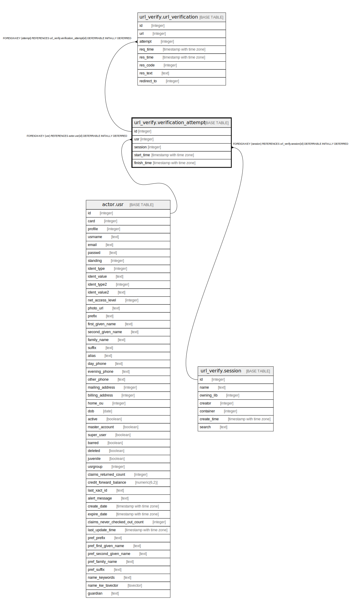

# url_verify.verification_attempt

## Description

## Columns

| Name | Type | Default | Nullable | Children | Parents | Comment |
| ---- | ---- | ------- | -------- | -------- | ------- | ------- |
| id | integer | nextval('url_verify.verification_attempt_id_seq'::regclass) | false | [url_verify.url_verification](url_verify.url_verification.md) |  |  |
| usr | integer |  | false |  | [actor.usr](actor.usr.md) |  |
| session | integer |  | false |  | [url_verify.session](url_verify.session.md) |  |
| start_time | timestamp with time zone | now() | false |  |  |  |
| finish_time | timestamp with time zone |  | true |  |  |  |

## Constraints

| Name | Type | Definition |
| ---- | ---- | ---------- |
| verification_attempt_usr_fkey | FOREIGN KEY | FOREIGN KEY (usr) REFERENCES actor.usr(id) DEFERRABLE INITIALLY DEFERRED |
| verification_attempt_session_fkey | FOREIGN KEY | FOREIGN KEY (session) REFERENCES url_verify.session(id) DEFERRABLE INITIALLY DEFERRED |
| verification_attempt_pkey | PRIMARY KEY | PRIMARY KEY (id) |

## Indexes

| Name | Definition |
| ---- | ---------- |
| verification_attempt_pkey | CREATE UNIQUE INDEX verification_attempt_pkey ON url_verify.verification_attempt USING btree (id) |

## Relations

---

> Generated by [tbls](https://github.com/k1LoW/tbls)
