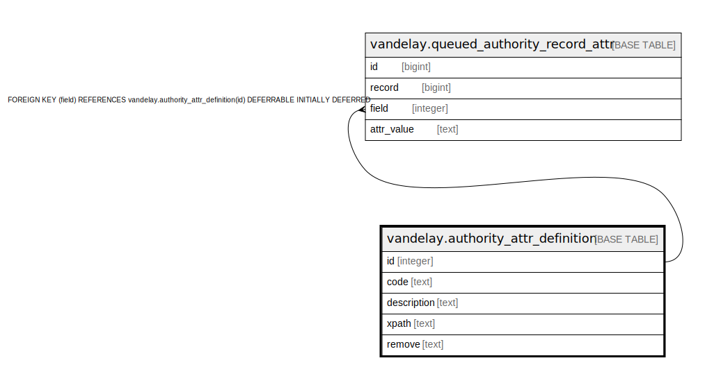

# vandelay.authority_attr_definition

## Description

## Columns

| Name | Type | Default | Nullable | Children | Parents | Comment |
| ---- | ---- | ------- | -------- | -------- | ------- | ------- |
| id | integer | nextval('vandelay.authority_attr_definition_id_seq'::regclass) | false | [vandelay.queued_authority_record_attr](vandelay.queued_authority_record_attr.md) |  |  |
| code | text |  | false |  |  |  |
| description | text |  | true |  |  |  |
| xpath | text |  | false |  |  |  |
| remove | text | ''::text | false |  |  |  |

## Constraints

| Name | Type | Definition |
| ---- | ---- | ---------- |
| authority_attr_definition_code_key | UNIQUE | UNIQUE (code) |
| authority_attr_definition_pkey | PRIMARY KEY | PRIMARY KEY (id) |

## Indexes

| Name | Definition |
| ---- | ---------- |
| authority_attr_definition_code_key | CREATE UNIQUE INDEX authority_attr_definition_code_key ON vandelay.authority_attr_definition USING btree (code) |
| authority_attr_definition_pkey | CREATE UNIQUE INDEX authority_attr_definition_pkey ON vandelay.authority_attr_definition USING btree (id) |

## Relations

---

> Generated by [tbls](https://github.com/k1LoW/tbls)
