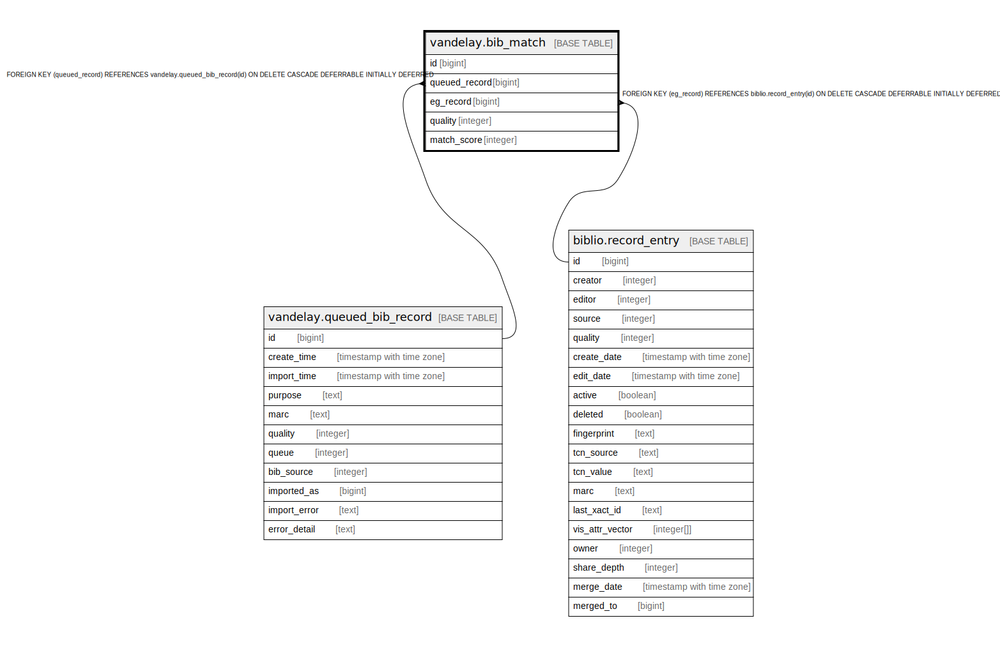

# vandelay.bib_match

## Description

## Columns

| Name | Type | Default | Nullable | Children | Parents | Comment |
| ---- | ---- | ------- | -------- | -------- | ------- | ------- |
| id | bigint | nextval('vandelay.bib_match_id_seq'::regclass) | false |  |  |  |
| queued_record | bigint |  | true |  | [vandelay.queued_bib_record](vandelay.queued_bib_record.md) |  |
| eg_record | bigint |  | true |  | [biblio.record_entry](biblio.record_entry.md) |  |
| quality | integer | 1 | false |  |  |  |
| match_score | integer | 0 | false |  |  |  |

## Constraints

| Name | Type | Definition |
| ---- | ---- | ---------- |
| bib_match_eg_record_fkey | FOREIGN KEY | FOREIGN KEY (eg_record) REFERENCES biblio.record_entry(id) ON DELETE CASCADE DEFERRABLE INITIALLY DEFERRED |
| bib_match_pkey | PRIMARY KEY | PRIMARY KEY (id) |
| bib_match_queued_record_fkey | FOREIGN KEY | FOREIGN KEY (queued_record) REFERENCES vandelay.queued_bib_record(id) ON DELETE CASCADE DEFERRABLE INITIALLY DEFERRED |

## Indexes

| Name | Definition |
| ---- | ---------- |
| bib_match_pkey | CREATE UNIQUE INDEX bib_match_pkey ON vandelay.bib_match USING btree (id) |
| bib_match_queued_record_idx | CREATE INDEX bib_match_queued_record_idx ON vandelay.bib_match USING btree (queued_record) |

## Relations

---

> Generated by [tbls](https://github.com/k1LoW/tbls)
