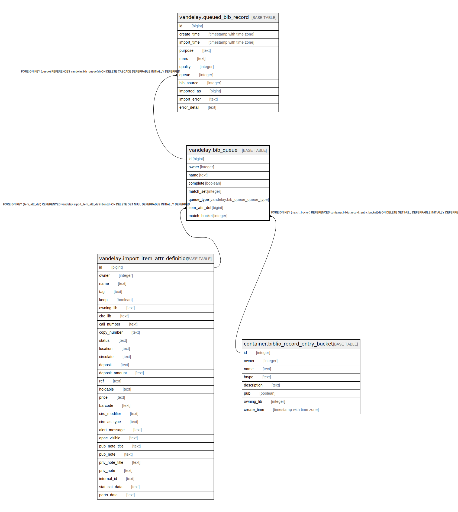

# vandelay.bib_queue

## Description

## Columns

| Name | Type | Default | Nullable | Children | Parents | Comment |
| ---- | ---- | ------- | -------- | -------- | ------- | ------- |
| id | bigint | nextval('vandelay.queue_id_seq'::regclass) | false | [vandelay.queued_bib_record](vandelay.queued_bib_record.md) |  |  |
| owner | integer |  | false |  |  |  |
| name | text |  | false |  |  |  |
| complete | boolean | false | false |  |  |  |
| match_set | integer |  | true |  |  |  |
| queue_type | vandelay.bib_queue_queue_type | 'bib'::vandelay.bib_queue_queue_type | false |  |  |  |
| item_attr_def | bigint |  | true |  | [vandelay.import_item_attr_definition](vandelay.import_item_attr_definition.md) |  |
| match_bucket | integer |  | true |  | [container.biblio_record_entry_bucket](container.biblio_record_entry_bucket.md) |  |

## Constraints

| Name | Type | Definition |
| ---- | ---- | ---------- |
| match_bucket_fkey | FOREIGN KEY | FOREIGN KEY (match_bucket) REFERENCES container.biblio_record_entry_bucket(id) ON DELETE SET NULL DEFERRABLE INITIALLY DEFERRED |
| bib_queue_pkey | PRIMARY KEY | PRIMARY KEY (id) |
| bib_queue_item_attr_def_fkey | FOREIGN KEY | FOREIGN KEY (item_attr_def) REFERENCES vandelay.import_item_attr_definition(id) ON DELETE SET NULL DEFERRABLE INITIALLY DEFERRED |
| vand_bib_queue_name_once_per_owner_const | UNIQUE | UNIQUE (owner, name, queue_type) |

## Indexes

| Name | Definition |
| ---- | ---------- |
| bib_queue_pkey | CREATE UNIQUE INDEX bib_queue_pkey ON vandelay.bib_queue USING btree (id) |
| vand_bib_queue_name_once_per_owner_const | CREATE UNIQUE INDEX vand_bib_queue_name_once_per_owner_const ON vandelay.bib_queue USING btree (owner, name, queue_type) |

## Relations

---

> Generated by [tbls](https://github.com/k1LoW/tbls)
