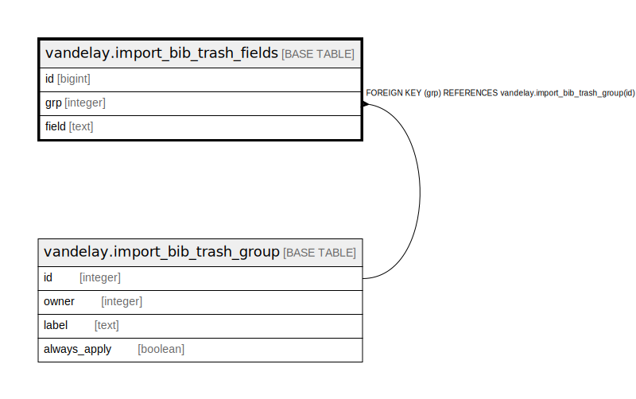

# vandelay.import_bib_trash_fields

## Description

## Columns

| Name | Type | Default | Nullable | Children | Parents | Comment |
| ---- | ---- | ------- | -------- | -------- | ------- | ------- |
| id | bigint | nextval('vandelay.import_bib_trash_fields_id_seq'::regclass) | false |  |  |  |
| grp | integer |  | false |  | [vandelay.import_bib_trash_group](vandelay.import_bib_trash_group.md) |  |
| field | text |  | false |  |  |  |

## Constraints

| Name | Type | Definition |
| ---- | ---- | ---------- |
| import_bib_trash_fields_pkey | PRIMARY KEY | PRIMARY KEY (id) |
| import_bib_trash_fields_grp_fkey | FOREIGN KEY | FOREIGN KEY (grp) REFERENCES vandelay.import_bib_trash_group(id) |
| vand_import_bib_trash_fields_once_per | UNIQUE | UNIQUE (grp, field) |

## Indexes

| Name | Definition |
| ---- | ---------- |
| import_bib_trash_fields_pkey | CREATE UNIQUE INDEX import_bib_trash_fields_pkey ON vandelay.import_bib_trash_fields USING btree (id) |
| vand_import_bib_trash_fields_once_per | CREATE UNIQUE INDEX vand_import_bib_trash_fields_once_per ON vandelay.import_bib_trash_fields USING btree (grp, field) |

## Relations

---

> Generated by [tbls](https://github.com/k1LoW/tbls)
