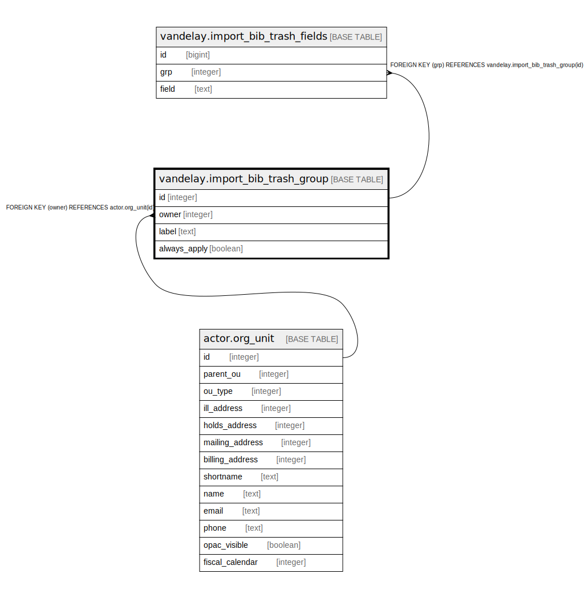

# vandelay.import_bib_trash_group

## Description

## Columns

| Name | Type | Default | Nullable | Children | Parents | Comment |
| ---- | ---- | ------- | -------- | -------- | ------- | ------- |
| id | integer | nextval('vandelay.import_bib_trash_group_id_seq'::regclass) | false | [vandelay.import_bib_trash_fields](vandelay.import_bib_trash_fields.md) |  |  |
| owner | integer |  | false |  | [actor.org_unit](actor.org_unit.md) |  |
| label | text |  | false |  |  |  |
| always_apply | boolean | false | false |  |  |  |

## Constraints

| Name | Type | Definition |
| ---- | ---- | ---------- |
| import_bib_trash_group_owner_fkey | FOREIGN KEY | FOREIGN KEY (owner) REFERENCES actor.org_unit(id) |
| import_bib_trash_group_pkey | PRIMARY KEY | PRIMARY KEY (id) |
| vand_import_bib_trash_grp_owner_label | UNIQUE | UNIQUE (owner, label) |

## Indexes

| Name | Definition |
| ---- | ---------- |
| import_bib_trash_group_pkey | CREATE UNIQUE INDEX import_bib_trash_group_pkey ON vandelay.import_bib_trash_group USING btree (id) |
| vand_import_bib_trash_grp_owner_label | CREATE UNIQUE INDEX vand_import_bib_trash_grp_owner_label ON vandelay.import_bib_trash_group USING btree (owner, label) |

## Relations

---

> Generated by [tbls](https://github.com/k1LoW/tbls)
