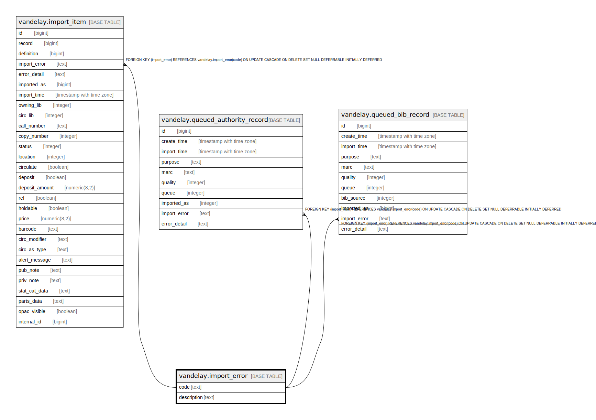

# vandelay.import_error

## Description

## Columns

| Name | Type | Default | Nullable | Children | Parents | Comment |
| ---- | ---- | ------- | -------- | -------- | ------- | ------- |
| code | text |  | false | [vandelay.import_item](vandelay.import_item.md) [vandelay.queued_authority_record](vandelay.queued_authority_record.md) [vandelay.queued_bib_record](vandelay.queued_bib_record.md) |  |  |
| description | text |  | false |  |  |  |

## Constraints

| Name | Type | Definition |
| ---- | ---- | ---------- |
| import_error_pkey | PRIMARY KEY | PRIMARY KEY (code) |

## Indexes

| Name | Definition |
| ---- | ---------- |
| import_error_pkey | CREATE UNIQUE INDEX import_error_pkey ON vandelay.import_error USING btree (code) |

## Relations

---

> Generated by [tbls](https://github.com/k1LoW/tbls)
