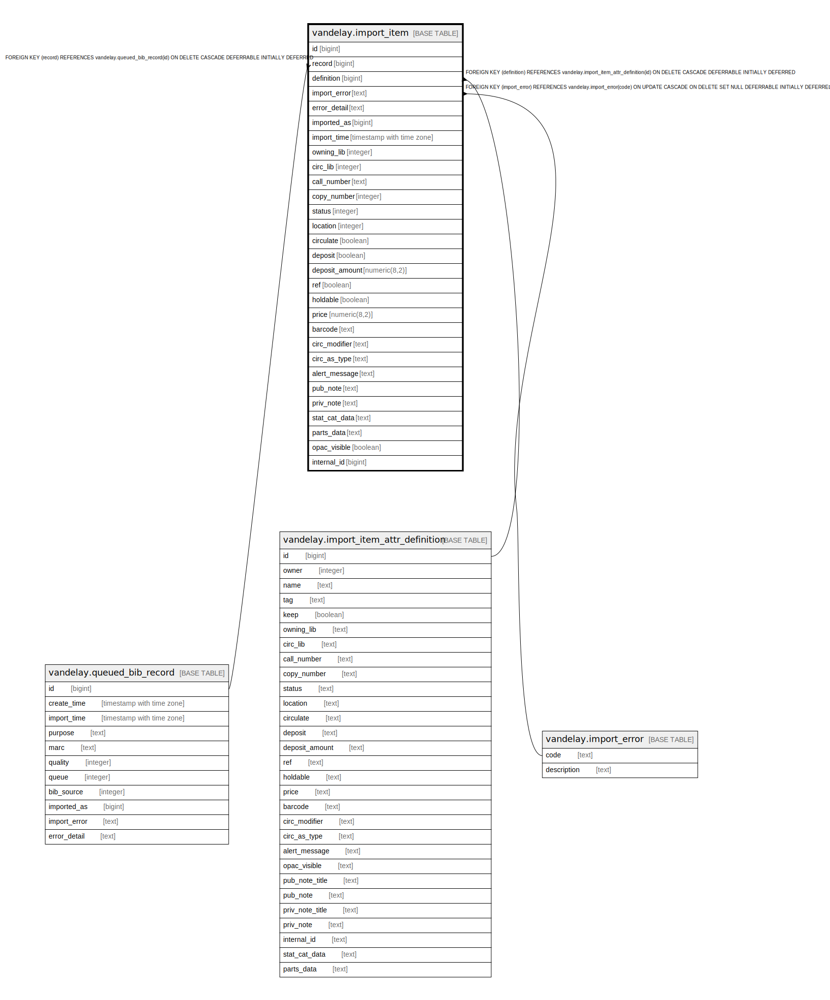

# vandelay.import_item

## Description

## Columns

| Name | Type | Default | Nullable | Children | Parents | Comment |
| ---- | ---- | ------- | -------- | -------- | ------- | ------- |
| id | bigint | nextval('vandelay.import_item_id_seq'::regclass) | false |  |  |  |
| record | bigint |  | false |  | [vandelay.queued_bib_record](vandelay.queued_bib_record.md) |  |
| definition | bigint |  | false |  | [vandelay.import_item_attr_definition](vandelay.import_item_attr_definition.md) |  |
| import_error | text |  | true |  | [vandelay.import_error](vandelay.import_error.md) |  |
| error_detail | text |  | true |  |  |  |
| imported_as | bigint |  | true |  |  |  |
| import_time | timestamp with time zone |  | true |  |  |  |
| owning_lib | integer |  | true |  |  |  |
| circ_lib | integer |  | true |  |  |  |
| call_number | text |  | true |  |  |  |
| copy_number | integer |  | true |  |  |  |
| status | integer |  | true |  |  |  |
| location | integer |  | true |  |  |  |
| circulate | boolean |  | true |  |  |  |
| deposit | boolean |  | true |  |  |  |
| deposit_amount | numeric(8,2) |  | true |  |  |  |
| ref | boolean |  | true |  |  |  |
| holdable | boolean |  | true |  |  |  |
| price | numeric(8,2) |  | true |  |  |  |
| barcode | text |  | true |  |  |  |
| circ_modifier | text |  | true |  |  |  |
| circ_as_type | text |  | true |  |  |  |
| alert_message | text |  | true |  |  |  |
| pub_note | text |  | true |  |  |  |
| priv_note | text |  | true |  |  |  |
| stat_cat_data | text |  | true |  |  |  |
| parts_data | text |  | true |  |  |  |
| opac_visible | boolean |  | true |  |  |  |
| internal_id | bigint |  | true |  |  |  |

## Constraints

| Name | Type | Definition |
| ---- | ---- | ---------- |
| inherit_import_item_imported_as_fkey | TRIGGER | CREATE CONSTRAINT TRIGGER inherit_import_item_imported_as_fkey AFTER INSERT OR UPDATE ON vandelay.import_item DEFERRABLE INITIALLY IMMEDIATE FOR EACH ROW EXECUTE PROCEDURE vandelay_import_item_imported_as_inh_fkey() |
| import_item_import_error_fkey | FOREIGN KEY | FOREIGN KEY (import_error) REFERENCES vandelay.import_error(code) ON UPDATE CASCADE ON DELETE SET NULL DEFERRABLE INITIALLY DEFERRED |
| import_item_definition_fkey | FOREIGN KEY | FOREIGN KEY (definition) REFERENCES vandelay.import_item_attr_definition(id) ON DELETE CASCADE DEFERRABLE INITIALLY DEFERRED |
| import_item_pkey | PRIMARY KEY | PRIMARY KEY (id) |
| import_item_record_fkey | FOREIGN KEY | FOREIGN KEY (record) REFERENCES vandelay.queued_bib_record(id) ON DELETE CASCADE DEFERRABLE INITIALLY DEFERRED |

## Indexes

| Name | Definition |
| ---- | ---------- |
| import_item_pkey | CREATE UNIQUE INDEX import_item_pkey ON vandelay.import_item USING btree (id) |
| import_item_record_idx | CREATE INDEX import_item_record_idx ON vandelay.import_item USING btree (record) |

## Triggers

| Name | Definition |
| ---- | ---------- |
| inherit_import_item_imported_as_fkey | CREATE CONSTRAINT TRIGGER inherit_import_item_imported_as_fkey AFTER INSERT OR UPDATE ON vandelay.import_item DEFERRABLE INITIALLY IMMEDIATE FOR EACH ROW EXECUTE PROCEDURE vandelay_import_item_imported_as_inh_fkey() |

## Relations

---

> Generated by [tbls](https://github.com/k1LoW/tbls)
