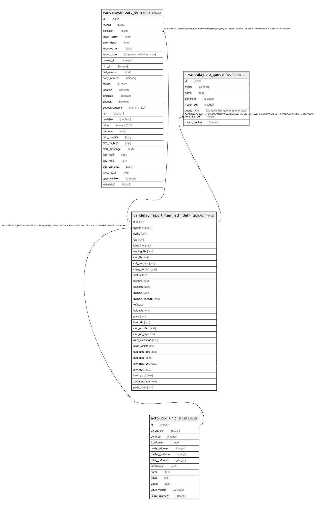

# vandelay.import_item_attr_definition

## Description

## Columns

| Name | Type | Default | Nullable | Children | Parents | Comment |
| ---- | ---- | ------- | -------- | -------- | ------- | ------- |
| id | bigint | nextval('vandelay.import_item_attr_definition_id_seq'::regclass) | false | [vandelay.import_item](vandelay.import_item.md) [vandelay.bib_queue](vandelay.bib_queue.md) |  |  |
| owner | integer |  | false |  | [actor.org_unit](actor.org_unit.md) |  |
| name | text |  | false |  |  |  |
| tag | text |  | false |  |  |  |
| keep | boolean | false | false |  |  |  |
| owning_lib | text |  | true |  |  |  |
| circ_lib | text |  | true |  |  |  |
| call_number | text |  | true |  |  |  |
| copy_number | text |  | true |  |  |  |
| status | text |  | true |  |  |  |
| location | text |  | true |  |  |  |
| circulate | text |  | true |  |  |  |
| deposit | text |  | true |  |  |  |
| deposit_amount | text |  | true |  |  |  |
| ref | text |  | true |  |  |  |
| holdable | text |  | true |  |  |  |
| price | text |  | true |  |  |  |
| barcode | text |  | true |  |  |  |
| circ_modifier | text |  | true |  |  |  |
| circ_as_type | text |  | true |  |  |  |
| alert_message | text |  | true |  |  |  |
| opac_visible | text |  | true |  |  |  |
| pub_note_title | text |  | true |  |  |  |
| pub_note | text |  | true |  |  |  |
| priv_note_title | text |  | true |  |  |  |
| priv_note | text |  | true |  |  |  |
| internal_id | text |  | true |  |  |  |
| stat_cat_data | text |  | true |  |  |  |
| parts_data | text |  | true |  |  |  |

## Constraints

| Name | Type | Definition |
| ---- | ---- | ---------- |
| import_item_attr_definition_owner_fkey | FOREIGN KEY | FOREIGN KEY (owner) REFERENCES actor.org_unit(id) ON UPDATE CASCADE ON DELETE CASCADE DEFERRABLE INITIALLY DEFERRED |
| import_item_attr_definition_pkey | PRIMARY KEY | PRIMARY KEY (id) |
| vand_import_item_attr_def_idx | UNIQUE | UNIQUE (owner, name) |

## Indexes

| Name | Definition |
| ---- | ---------- |
| import_item_attr_definition_pkey | CREATE UNIQUE INDEX import_item_attr_definition_pkey ON vandelay.import_item_attr_definition USING btree (id) |
| vand_import_item_attr_def_idx | CREATE UNIQUE INDEX vand_import_item_attr_def_idx ON vandelay.import_item_attr_definition USING btree (owner, name) |

## Relations

---

> Generated by [tbls](https://github.com/k1LoW/tbls)
