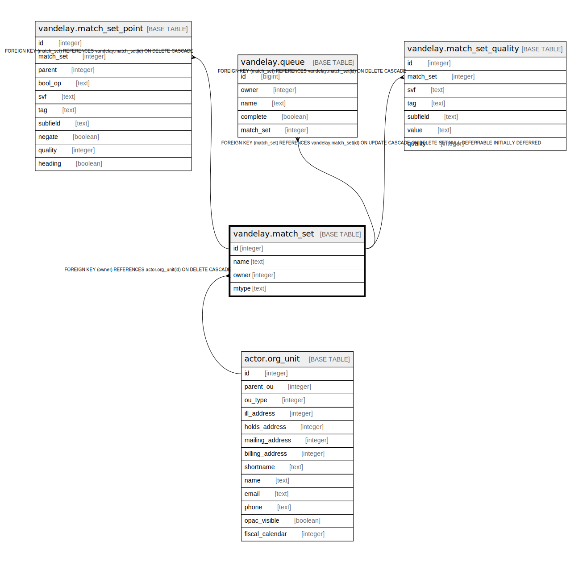

# vandelay.match_set

## Description

## Columns

| Name | Type | Default | Nullable | Children | Parents | Comment |
| ---- | ---- | ------- | -------- | -------- | ------- | ------- |
| id | integer | nextval('vandelay.match_set_id_seq'::regclass) | false | [vandelay.match_set_point](vandelay.match_set_point.md) [vandelay.queue](vandelay.queue.md) [vandelay.match_set_quality](vandelay.match_set_quality.md) |  |  |
| name | text |  | false |  |  |  |
| owner | integer |  | false |  | [actor.org_unit](actor.org_unit.md) |  |
| mtype | text | 'biblio'::text | false |  |  |  |

## Constraints

| Name | Type | Definition |
| ---- | ---- | ---------- |
| match_set_owner_fkey | FOREIGN KEY | FOREIGN KEY (owner) REFERENCES actor.org_unit(id) ON DELETE CASCADE |
| match_set_pkey | PRIMARY KEY | PRIMARY KEY (id) |
| name_once_per_owner_mtype | UNIQUE | UNIQUE (name, owner, mtype) |

## Indexes

| Name | Definition |
| ---- | ---------- |
| match_set_pkey | CREATE UNIQUE INDEX match_set_pkey ON vandelay.match_set USING btree (id) |
| name_once_per_owner_mtype | CREATE UNIQUE INDEX name_once_per_owner_mtype ON vandelay.match_set USING btree (name, owner, mtype) |

## Relations

---

> Generated by [tbls](https://github.com/k1LoW/tbls)
