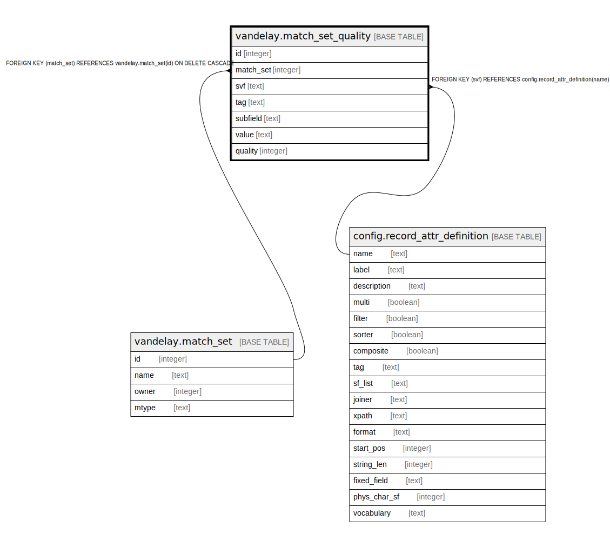

# vandelay.match_set_quality

## Description

## Columns

| Name | Type | Default | Nullable | Children | Parents | Comment |
| ---- | ---- | ------- | -------- | -------- | ------- | ------- |
| id | integer | nextval('vandelay.match_set_quality_id_seq'::regclass) | false |  |  |  |
| match_set | integer |  | false |  | [vandelay.match_set](vandelay.match_set.md) |  |
| svf | text |  | true |  | [config.record_attr_definition](config.record_attr_definition.md) |  |
| tag | text |  | true |  |  |  |
| subfield | text |  | true |  |  |  |
| value | text |  | false |  |  |  |
| quality | integer | 1 | false |  |  |  |

## Constraints

| Name | Type | Definition |
| ---- | ---- | ---------- |
| vmsq_need_a_subfield_with_a_tag | CHECK | CHECK ((((tag IS NOT NULL) AND (subfield IS NOT NULL)) OR (tag IS NULL))) |
| vmsq_need_a_tag_or_a_ff | CHECK | CHECK ((((tag IS NOT NULL) AND (svf IS NULL)) OR ((tag IS NULL) AND (svf IS NOT NULL)))) |
| match_set_quality_svf_fkey | FOREIGN KEY | FOREIGN KEY (svf) REFERENCES config.record_attr_definition(name) |
| match_set_quality_match_set_fkey | FOREIGN KEY | FOREIGN KEY (match_set) REFERENCES vandelay.match_set(id) ON DELETE CASCADE |
| match_set_quality_pkey | PRIMARY KEY | PRIMARY KEY (id) |

## Indexes

| Name | Definition |
| ---- | ---------- |
| match_set_quality_pkey | CREATE UNIQUE INDEX match_set_quality_pkey ON vandelay.match_set_quality USING btree (id) |
| vmsq_def_once_per_set | CREATE UNIQUE INDEX vmsq_def_once_per_set ON vandelay.match_set_quality USING btree (match_set, COALESCE(tag, ''::text), COALESCE(subfield, ''::text), COALESCE(svf, ''::text), value) |

## Relations

---

> Generated by [tbls](https://github.com/k1LoW/tbls)
