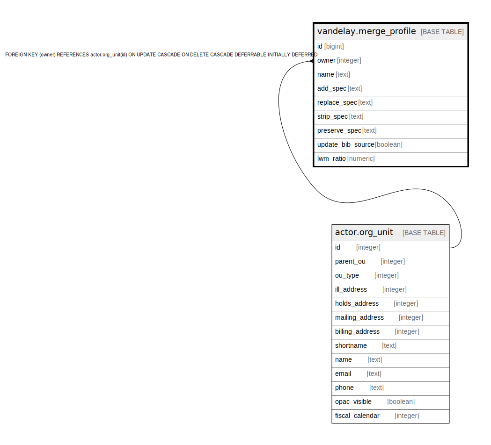

# vandelay.merge_profile

## Description

## Columns

| Name | Type | Default | Nullable | Children | Parents | Comment |
| ---- | ---- | ------- | -------- | -------- | ------- | ------- |
| id | bigint | nextval('vandelay.merge_profile_id_seq'::regclass) | false |  |  |  |
| owner | integer |  | false |  | [actor.org_unit](actor.org_unit.md) |  |
| name | text |  | false |  |  |  |
| add_spec | text |  | true |  |  |  |
| replace_spec | text |  | true |  |  |  |
| strip_spec | text |  | true |  |  |  |
| preserve_spec | text |  | true |  |  |  |
| update_bib_source | boolean | false | false |  |  |  |
| lwm_ratio | numeric |  | true |  |  |  |

## Constraints

| Name | Type | Definition |
| ---- | ---- | ---------- |
| add_replace_strip_or_preserve | CHECK | CHECK (((preserve_spec IS NOT NULL) OR (replace_spec IS NOT NULL) OR ((preserve_spec IS NULL) AND (replace_spec IS NULL)))) |
| merge_profile_owner_fkey | FOREIGN KEY | FOREIGN KEY (owner) REFERENCES actor.org_unit(id) ON UPDATE CASCADE ON DELETE CASCADE DEFERRABLE INITIALLY DEFERRED |
| merge_profile_pkey | PRIMARY KEY | PRIMARY KEY (id) |
| vand_merge_prof_owner_name_idx | UNIQUE | UNIQUE (owner, name) |

## Indexes

| Name | Definition |
| ---- | ---------- |
| merge_profile_pkey | CREATE UNIQUE INDEX merge_profile_pkey ON vandelay.merge_profile USING btree (id) |
| vand_merge_prof_owner_name_idx | CREATE UNIQUE INDEX vand_merge_prof_owner_name_idx ON vandelay.merge_profile USING btree (owner, name) |

## Relations

---

> Generated by [tbls](https://github.com/k1LoW/tbls)
