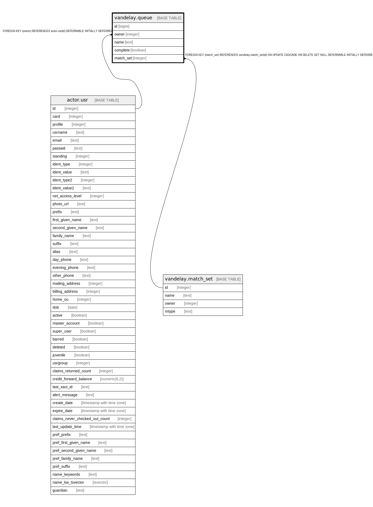

# vandelay.queue

## Description

## Columns

| Name | Type | Default | Nullable | Children | Parents | Comment |
| ---- | ---- | ------- | -------- | -------- | ------- | ------- |
| id | bigint | nextval('vandelay.queue_id_seq'::regclass) | false |  |  |  |
| owner | integer |  | false |  | [actor.usr](actor.usr.md) |  |
| name | text |  | false |  |  |  |
| complete | boolean | false | false |  |  |  |
| match_set | integer |  | true |  | [vandelay.match_set](vandelay.match_set.md) |  |

## Constraints

| Name | Type | Definition |
| ---- | ---- | ---------- |
| queue_owner_fkey | FOREIGN KEY | FOREIGN KEY (owner) REFERENCES actor.usr(id) DEFERRABLE INITIALLY DEFERRED |
| queue_match_set_fkey | FOREIGN KEY | FOREIGN KEY (match_set) REFERENCES vandelay.match_set(id) ON UPDATE CASCADE ON DELETE SET NULL DEFERRABLE INITIALLY DEFERRED |
| queue_pkey | PRIMARY KEY | PRIMARY KEY (id) |

## Indexes

| Name | Definition |
| ---- | ---------- |
| queue_pkey | CREATE UNIQUE INDEX queue_pkey ON vandelay.queue USING btree (id) |

## Relations

---

> Generated by [tbls](https://github.com/k1LoW/tbls)
