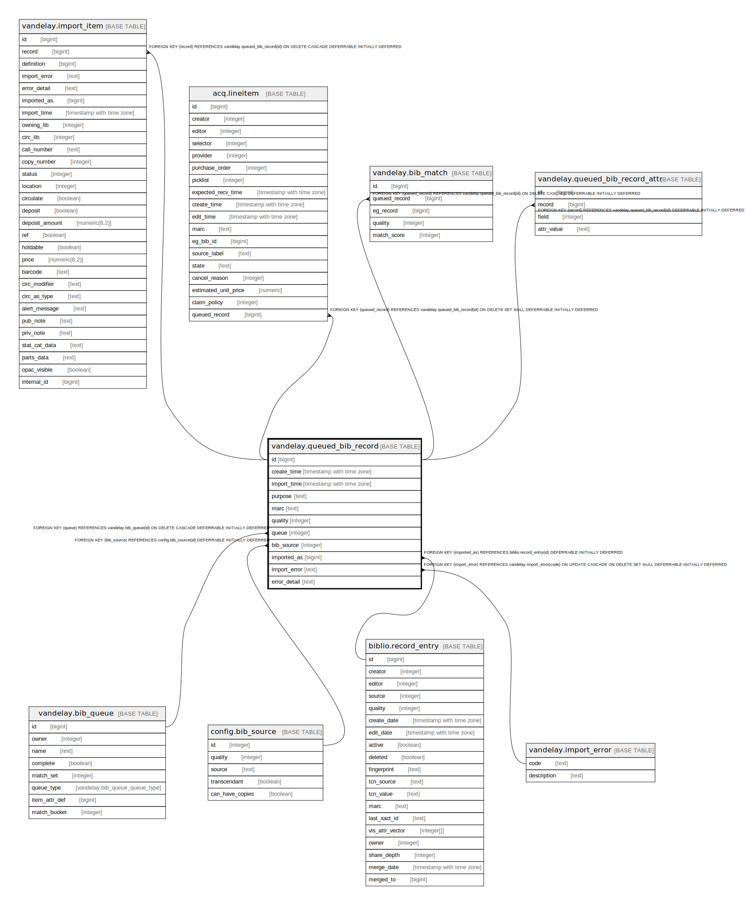

# vandelay.queued_bib_record

## Description

## Columns

| Name | Type | Default | Nullable | Children | Parents | Comment |
| ---- | ---- | ------- | -------- | -------- | ------- | ------- |
| id | bigint | nextval('vandelay.queued_record_id_seq'::regclass) | false | [vandelay.import_item](vandelay.import_item.md) [acq.lineitem](acq.lineitem.md) [vandelay.bib_match](vandelay.bib_match.md) [vandelay.queued_bib_record_attr](vandelay.queued_bib_record_attr.md) |  |  |
| create_time | timestamp with time zone | now() | false |  |  |  |
| import_time | timestamp with time zone |  | true |  |  |  |
| purpose | text | 'import'::text | false |  |  |  |
| marc | text |  | false |  |  |  |
| quality | integer | 0 | false |  |  |  |
| queue | integer |  | false |  | [vandelay.bib_queue](vandelay.bib_queue.md) |  |
| bib_source | integer |  | true |  | [config.bib_source](config.bib_source.md) |  |
| imported_as | bigint |  | true |  | [biblio.record_entry](biblio.record_entry.md) |  |
| import_error | text |  | true |  | [vandelay.import_error](vandelay.import_error.md) |  |
| error_detail | text |  | true |  |  |  |

## Constraints

| Name | Type | Definition |
| ---- | ---- | ---------- |
| queued_record_purpose_check | CHECK | CHECK ((purpose = ANY (ARRAY['import'::text, 'overlay'::text]))) |
| queued_bib_record_imported_as_fkey | FOREIGN KEY | FOREIGN KEY (imported_as) REFERENCES biblio.record_entry(id) DEFERRABLE INITIALLY DEFERRED |
| queued_bib_record_bib_source_fkey | FOREIGN KEY | FOREIGN KEY (bib_source) REFERENCES config.bib_source(id) DEFERRABLE INITIALLY DEFERRED |
| queued_bib_record_queue_fkey | FOREIGN KEY | FOREIGN KEY (queue) REFERENCES vandelay.bib_queue(id) ON DELETE CASCADE DEFERRABLE INITIALLY DEFERRED |
| queued_bib_record_import_error_fkey | FOREIGN KEY | FOREIGN KEY (import_error) REFERENCES vandelay.import_error(code) ON UPDATE CASCADE ON DELETE SET NULL DEFERRABLE INITIALLY DEFERRED |
| queued_bib_record_pkey | PRIMARY KEY | PRIMARY KEY (id) |

## Indexes

| Name | Definition |
| ---- | ---------- |
| queued_bib_record_pkey | CREATE UNIQUE INDEX queued_bib_record_pkey ON vandelay.queued_bib_record USING btree (id) |
| queued_bib_record_queue_idx | CREATE INDEX queued_bib_record_queue_idx ON vandelay.queued_bib_record USING btree (queue) |

## Triggers

| Name | Definition |
| ---- | ---------- |
| cleanup_bib_trigger | CREATE TRIGGER cleanup_bib_trigger BEFORE DELETE OR UPDATE ON vandelay.queued_bib_record FOR EACH ROW EXECUTE PROCEDURE vandelay.cleanup_bib_marc() |
| ingest_bib_trigger | CREATE TRIGGER ingest_bib_trigger AFTER INSERT OR UPDATE ON vandelay.queued_bib_record FOR EACH ROW EXECUTE PROCEDURE vandelay.ingest_bib_marc() |
| ingest_item_trigger | CREATE TRIGGER ingest_item_trigger AFTER INSERT OR UPDATE ON vandelay.queued_bib_record FOR EACH ROW EXECUTE PROCEDURE vandelay.ingest_bib_items() |
| zz_match_bibs_trigger | CREATE TRIGGER zz_match_bibs_trigger BEFORE INSERT OR UPDATE ON vandelay.queued_bib_record FOR EACH ROW EXECUTE PROCEDURE vandelay.match_bib_record() |

## Relations

---

> Generated by [tbls](https://github.com/k1LoW/tbls)
