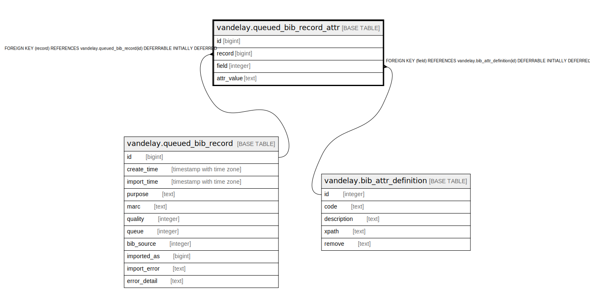

# vandelay.queued_bib_record_attr

## Description

## Columns

| Name | Type | Default | Nullable | Children | Parents | Comment |
| ---- | ---- | ------- | -------- | -------- | ------- | ------- |
| id | bigint | nextval('vandelay.queued_bib_record_attr_id_seq'::regclass) | false |  |  |  |
| record | bigint |  | false |  | [vandelay.queued_bib_record](vandelay.queued_bib_record.md) |  |
| field | integer |  | false |  | [vandelay.bib_attr_definition](vandelay.bib_attr_definition.md) |  |
| attr_value | text |  | false |  |  |  |

## Constraints

| Name | Type | Definition |
| ---- | ---- | ---------- |
| queued_bib_record_attr_field_fkey | FOREIGN KEY | FOREIGN KEY (field) REFERENCES vandelay.bib_attr_definition(id) DEFERRABLE INITIALLY DEFERRED |
| queued_bib_record_attr_pkey | PRIMARY KEY | PRIMARY KEY (id) |
| queued_bib_record_attr_record_fkey | FOREIGN KEY | FOREIGN KEY (record) REFERENCES vandelay.queued_bib_record(id) DEFERRABLE INITIALLY DEFERRED |

## Indexes

| Name | Definition |
| ---- | ---------- |
| queued_bib_record_attr_pkey | CREATE UNIQUE INDEX queued_bib_record_attr_pkey ON vandelay.queued_bib_record_attr USING btree (id) |
| queued_bib_record_attr_record_idx | CREATE INDEX queued_bib_record_attr_record_idx ON vandelay.queued_bib_record_attr USING btree (record) |

## Relations

---

> Generated by [tbls](https://github.com/k1LoW/tbls)
