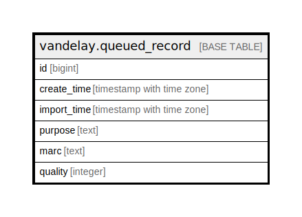

# vandelay.queued_record

## Description

## Columns

| Name | Type | Default | Nullable | Children | Parents | Comment |
| ---- | ---- | ------- | -------- | -------- | ------- | ------- |
| id | bigint | nextval('vandelay.queued_record_id_seq'::regclass) | false |  |  |  |
| create_time | timestamp with time zone | now() | false |  |  |  |
| import_time | timestamp with time zone |  | true |  |  |  |
| purpose | text | 'import'::text | false |  |  |  |
| marc | text |  | false |  |  |  |
| quality | integer | 0 | false |  |  |  |

## Constraints

| Name | Type | Definition |
| ---- | ---- | ---------- |
| queued_record_purpose_check | CHECK | CHECK ((purpose = ANY (ARRAY['import'::text, 'overlay'::text]))) |
| queued_record_pkey | PRIMARY KEY | PRIMARY KEY (id) |

## Indexes

| Name | Definition |
| ---- | ---------- |
| queued_record_pkey | CREATE UNIQUE INDEX queued_record_pkey ON vandelay.queued_record USING btree (id) |

## Relations

---

> Generated by [tbls](https://github.com/k1LoW/tbls)
