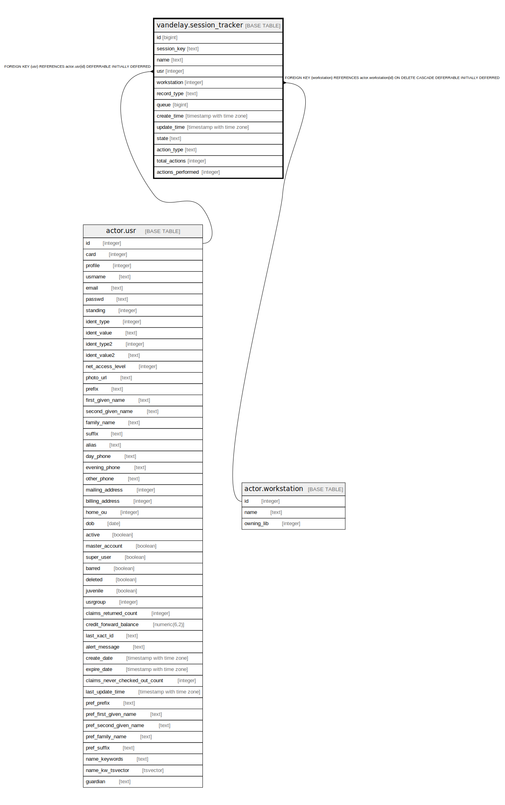

# vandelay.session_tracker

## Description

## Columns

| Name | Type | Default | Nullable | Children | Parents | Comment |
| ---- | ---- | ------- | -------- | -------- | ------- | ------- |
| id | bigint | nextval('vandelay.session_tracker_id_seq'::regclass) | false |  |  |  |
| session_key | text |  | false |  |  |  |
| name | text |  | false |  |  |  |
| usr | integer |  | false |  | [actor.usr](actor.usr.md) |  |
| workstation | integer |  | false |  | [actor.workstation](actor.workstation.md) |  |
| record_type | text | 'bib'::text | false |  |  |  |
| queue | bigint |  | false |  |  |  |
| create_time | timestamp with time zone | now() | false |  |  |  |
| update_time | timestamp with time zone | now() | false |  |  |  |
| state | text | 'active'::text | false |  |  |  |
| action_type | text | 'enqueue'::text | false |  |  |  |
| total_actions | integer | 0 | false |  |  |  |
| actions_performed | integer | 0 | false |  |  |  |

## Constraints

| Name | Type | Definition |
| ---- | ---- | ---------- |
| vand_tracker_valid_action_type | CHECK | CHECK ((action_type = ANY (ARRAY['upload'::text, 'enqueue'::text, 'import'::text]))) |
| vand_tracker_valid_record_type | CHECK | CHECK ((record_type = ANY (ARRAY['bib'::text, 'authority'::text]))) |
| vand_tracker_valid_state | CHECK | CHECK ((state = ANY (ARRAY['active'::text, 'error'::text, 'complete'::text]))) |
| session_tracker_usr_fkey | FOREIGN KEY | FOREIGN KEY (usr) REFERENCES actor.usr(id) DEFERRABLE INITIALLY DEFERRED |
| session_tracker_workstation_fkey | FOREIGN KEY | FOREIGN KEY (workstation) REFERENCES actor.workstation(id) ON DELETE CASCADE DEFERRABLE INITIALLY DEFERRED |
| session_tracker_pkey | PRIMARY KEY | PRIMARY KEY (id) |

## Indexes

| Name | Definition |
| ---- | ---------- |
| session_tracker_pkey | CREATE UNIQUE INDEX session_tracker_pkey ON vandelay.session_tracker USING btree (id) |

## Relations

---

> Generated by [tbls](https://github.com/k1LoW/tbls)
